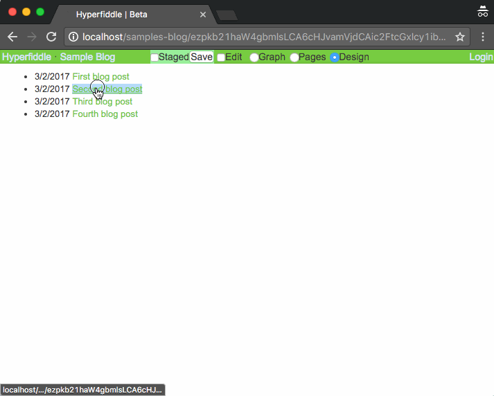

# hypercrud.client

> Browser UI <=> service data sync backed by Datomic

For a blog post intro, see this transcript of a talk: [Composable UI, May 2016](https://docs.google.com/document/d/1hb9qB_d9jlDUpgTSBcFELGhKuWVecVzgGCcOeR9UueE/edit?usp=sharing)

Hypercrud is the open source I/O runtime powering [hyperfiddle.net](http://hyperfiddle.net/). Coming soon!

