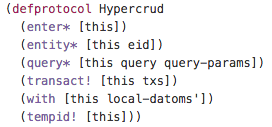
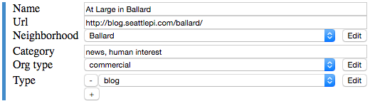
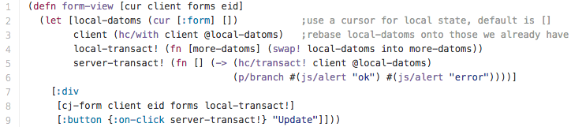
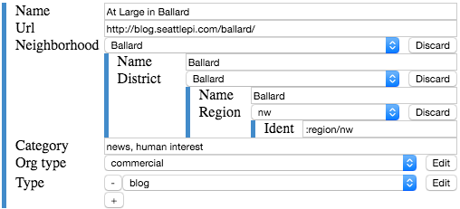

# hypercrud.client

Hypercrud has two layers of abstraction: a lower-level I/O runtime enabling separation of UI from I/O; and a higher-level data-driven hypermedia layer built on top of UI expressions.

The lower layer is roughly analogous to a Datomic peer running in the browser. The capabilities are described by the Hypercrud protocol:

This protocol may be implemented on top of HTTP, websockets or any other network layer, the implementation is responsible for answering queries out of cache as well as coordinating with the hypercrud service to populate caches.

## Composable programming model

Here is a simple example of a UI expression - part of the code for our blog actually:

- `[hcr/query client '[:find [?e ...] :where [?e :post/title]] ...` is a query 
- `[hcr/entity client eid ...` is also a query
- Note that the entity query is inside a `map`
- `client` represents lazy read access to the value of the hypercrud graph.

## Hypermedia functions

Here is a data driven form using the hypermedia library included in the `hypercrud.ui` namespace:

Here is the full code for this form:

- `form` is hypermedia metadata for rendering the form, 
- `local-datoms` is ui state for uncommitted form updates - this is a timeseries
- `(hc/with client @local-datoms)` is how we make our local updates locally available to down-tree graph queries; this reference is rebuilt when a local-datoms atom change causes a render
- `local-transact!` is how the form appends more updates for each user action
- `server-transact!` is how we send our local-datoms to the server as a transaction

This hypermedia form is backed by the hypercrud graph, and can navigate recursively into the graph.

This hypermedia form function does have component local state but that is an implementation detail; hypercrud is currently built on React via Reagent so you can use whatever state model you like. We suggest avoiding local state for maximizing the utility of server side rendering, though the hypercrud runtime should be smart enough to discover and optimize data dependencies even in the presence of local state.
